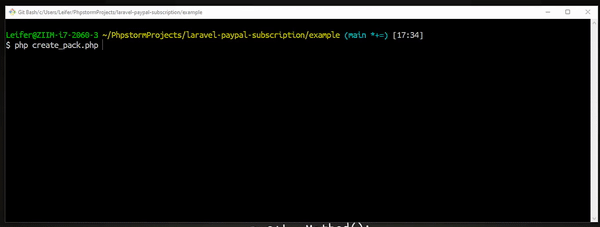

# Laravel PAYAPAL  (Subscripciones)

Realiza cobros en paypal de forma periódica y automatiza haciendo uso de subscripción con PAYPAL.
> __NOTA__: Antes continuar recuerda solicitar tus credenciales de acceso en [PAYPAL](https://developer.paypal.com/developer/applications/create)

<a href="https://www.buymeacoffee.com/leifermendez" target="_blank"></a>
----


#### Instalar

`composer require leifermendez/laravel-paypal-subscription`

#### Laravel 5.4 o inferior

Add the service provider to your `config/app.php` file:

```php

    'providers' => array(

        //...
        leifermendez\paypal\ProviderPaypalSubscription

    ),

```

Add the facade to your `config/app.php` file:

```php

    'aliases'       => array(

        //...
        'PapyalSubscription'  => leifermendez\paypal\PaypalSubscriptionFacade,

    ),

```

#### Uso

> Recuerda colocar tus credenciales en tu archivo .env
>, Mode: "test" or "live"

```
# PAYPAL SUBSCRIPTION

PAYPAL_APP_ID=xxxxxxxxxxxx
PAYPAL_APP_SK=xxxxxxxxxxxx
PAYPAL_APP_MODE=test
```

---


#### Productos
Si quieres ver todas las opciones posibles

https://developer.paypal.com/docs/api/catalog-products/v1/#products_create

__CREAR (producto)__
```php
    
    $product = [
        'name' => 'iPhone X',
        'description' => 'Awesome item, phone, etc',
        'type' => 'SERVICE',
        'category' => 'SOFTWARE',
        'image_url' => 'https://avatars.githubusercontent.com/u/15802366?s=460&u=ac6cc646599f2ed6c4699a74b15192a29177f85a&v=4',
        'home_url' => 'https://github.com/leifermendez/laravel-paypal-subscription',
    ];
    
    $response = PapyalSubscription::createProduct($product);

    dd($response);

```


__LISTAR (producto)__
```php

    $response = PapyalSubscription::getProduct();
    dd($response);
```


#### Planes
Si quieres ver todas las opciones posibles

https://developer.paypal.com/docs/api/subscriptions/v1/#plans

__CREAR (plan)__
```php
    
    $plan = [
        'name' => 'Video Streaming Service Plan',
        'description' => 'Video Streaming Service basic plan',
        'status' => 'ACTIVE',
        'billing_cycles' => [
            [
                'frequency' => [
                    'interval_unit' => 'MONTH',
                    'interval_count' => '1'
                ],
                'tenure_type' => 'REGULAR',
                'sequence' => '1',
                'total_cycles' => '12',
                'pricing_scheme' => [
                    'fixed_price' => [
                        'value' => '3',
                        'currency_code' => 'USD'
                    ]
                ]
            ]
        ],
        'payment_preferences' => [
            'auto_bill_outstanding' => 'true',
            'setup_fee' => [
                'value' => '10',
                'currency_code' => 'USD'
            ],
            'setup_fee_failure_action' => 'CONTINUE',
            'payment_failure_threshold' => '3'
        ],
        'taxes' => [
            'percentage' => '10',
            'inclusive' => false
        ]
    ];
    
    $product = [
        'product_id' => 'PROD-5C186753RC8244822' //<--------***** ID DEL PRODUCTO
    ];
    
    
    $response = PapyalSubscription::createPlan($plan, $product);

    dd($response);

```


__LISTAR (plan)__
```php

    $response = PapyalSubscription::getPlans();
    dd($response);
```

#### Subscripciones
Si quieres ver todas las opciones posibles

https://developer.paypal.com/docs/api/subscriptions/v1/#subscriptions

__CREAR (subscripciones)__
```php
    
    $subscription = [
        'start_time' => '2022-11-01T00:00:00Z',
        'quantity' => '1',
        'shipping_amount' => [
            'currency_code' => 'USD',
            'value' => '10'
        ],
        'subscriber' => [
            'name' => [
                'given_name' => 'Leifer',
                'surname' => 'Mendez'
            ],
            'email_address' => 'leifer@test.com',
            'shipping_address' => [
                'name' => [
                    'full_name' => 'Joe'
                ],
                'address' => [
                    'address_line_1' => '2211 N First Street',
                    'address_line_2' => 'Building  17',
                    'admin_area_2' => 'San Jose',
                    'admin_area_1' => 'CA',
                    'postal_code' => '95131',
                    'country_code' => 'US'
                ]
            ]
        ],
        'application_context' => [
            'brand_name' => 'Racks',
            'locale' => 'es-ES',
            'shipping_preference' => 'SET_PROVIDED_ADDRESS',
            'user_action' => 'SUBSCRIBE_NOW',
            'payment_method' => [
                'payer_selected' => 'PAYPAL',
                'payee_preferred' => 'IMMEDIATE_PAYMENT_REQUIRED',
            ],
            'return_url' => 'https://github.com/leifermendez?status=returnSuccess',
            'cancel_url' => 'https://github.com/leifermendez?status=cancelUrl'
    
        ]
    ];
    
    $plan = [
        'plan_id' => 'P-6LP13543ED649531TMAWPBHA' // <-------- ************ ID DEL PLAN CREADO
    ];
    
    
    $response = PapyalSubscription::createSubscription($subscription, $plan);

```


__DETALLE (subscripcion)__
```php
    $id_subscription = 'I-25E9NV7WG2G3'; // <----- ********* ID SUBSCRIPCION
    $response = PapyalSubscription::getSubscription($id_subscription);
    dd($response);

```

__SUSPENDER (subscripcion)__
> __NOTA__ Solo puedes suspender una subscripcion que previamente el status sea `ACTIVE`.

```php
    $id_subscription = 'I-25E9NV7WG2G3'; // <----- ********* ID SUBSCRIPCION
    $response = PapyalSubscription::suspendSubscription($id_subscription);
    dd($response);

```

__CANCELAR (subscripcion)__

```php
    $id_subscription = 'I-25E9NV7WG2G3'; // <----- ********* ID SUBSCRIPCION
    $response = PapyalSubscription::cancelSubscription($id_subscription);
    dd($response);

```

#### Flujo Subscripcion 


#### Diagrama

